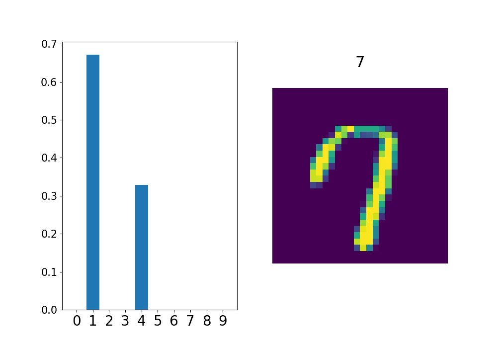
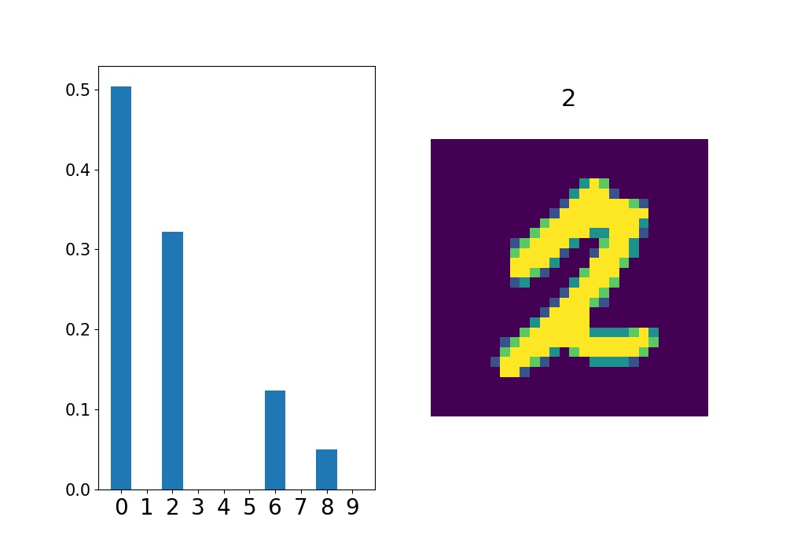
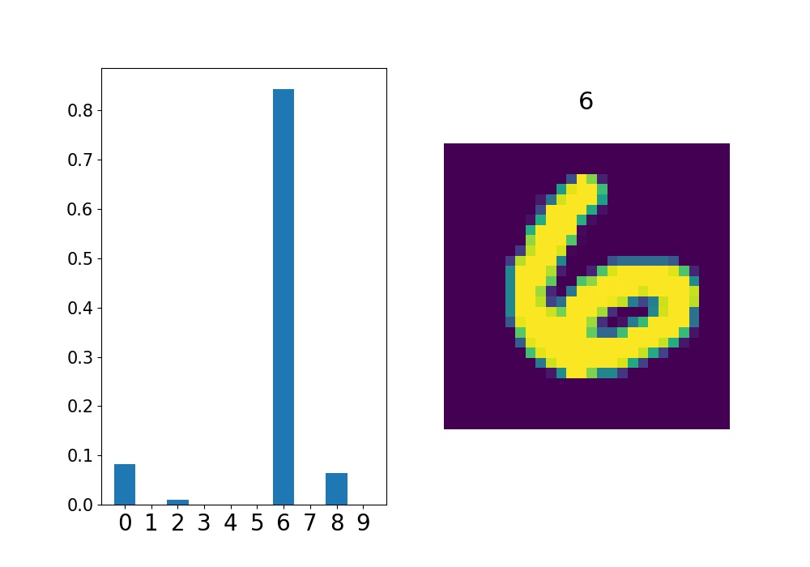
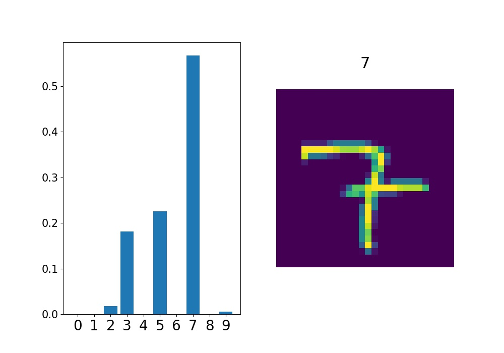
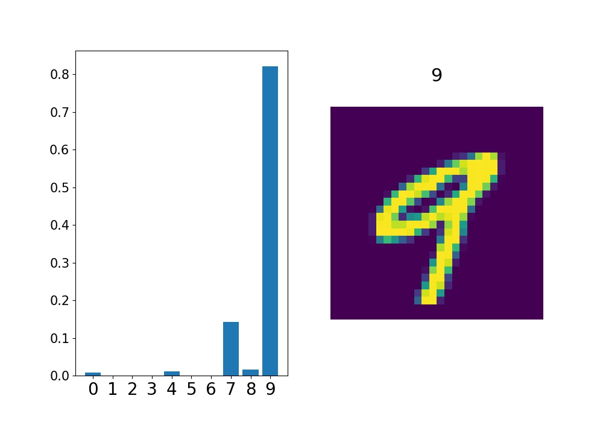
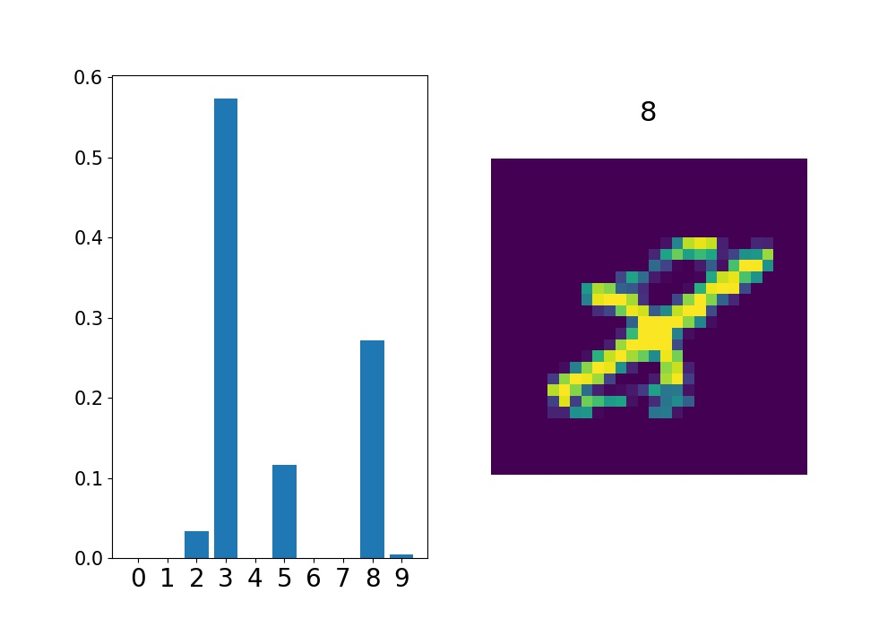
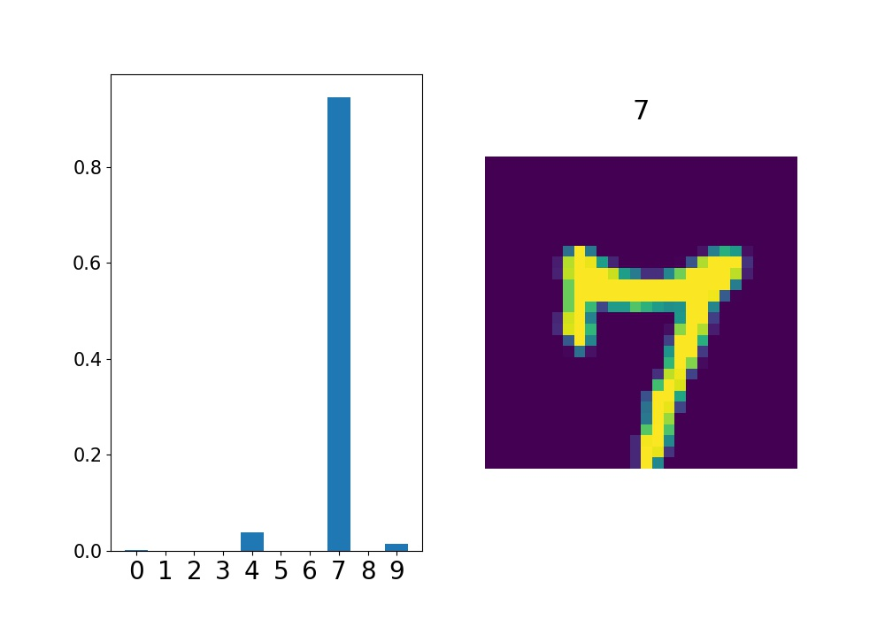
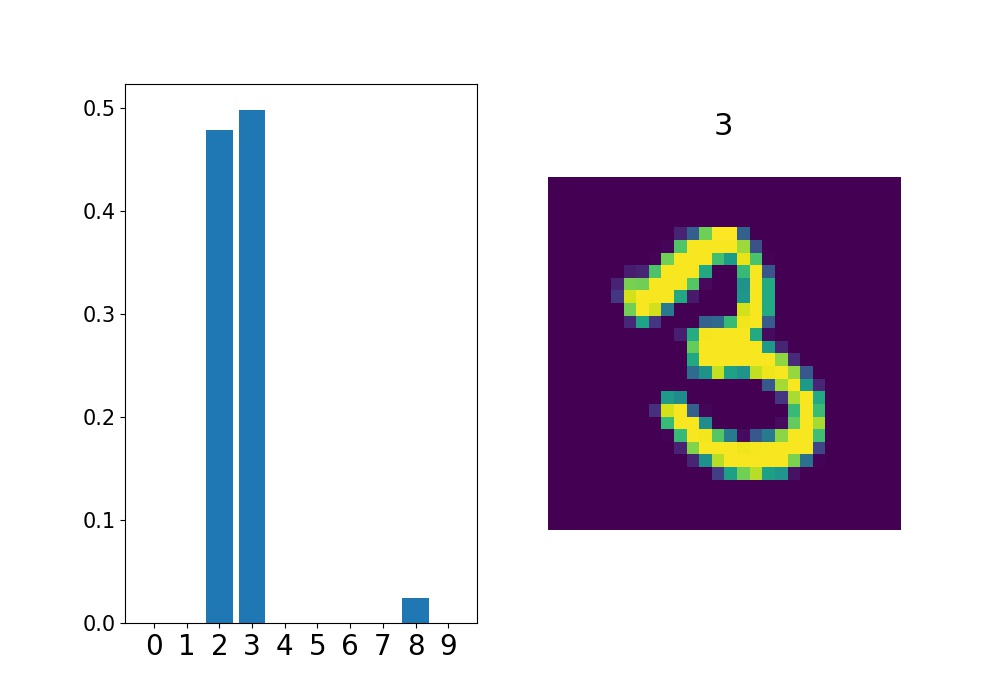

# mnist-mc-dropout

## Description

Writing Python (Tensorflow + eager execution) code for representing model uncertainty in deep learning. 

Based on the following:   
[Dropout as a Bayesian Approximation: Representing Model Uncertainty in Deep Learning](https://arxiv.org/abs/1506.02142)    
[Dropout as a Bayesian Approximation: Appendix](https://arxiv.org/abs/1506.02157)

## Training
run `python mnist.py`
The training process is defined in `mnist.py`, after training 1 epoch, the weight will save as `weight.h5`.

## Uncertain
run `python uncertain.py`
The model uncertainty is calculated in `uncerrtain.py`.

Each test image uses 500 stochastic forward propagations of neural networks. 
In each forward propagation, we calculate the final `logits` of neural network, and 
take *argmax* to get the output class. 

The ratio of different output classes in 500 runs is calculated, and 
we plot a figure for each test image.

### Uncertain Results (some):

 

